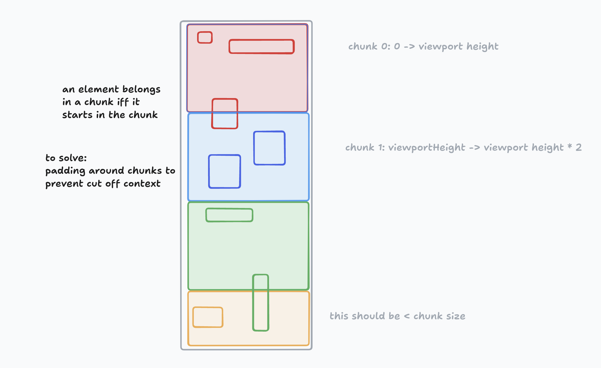
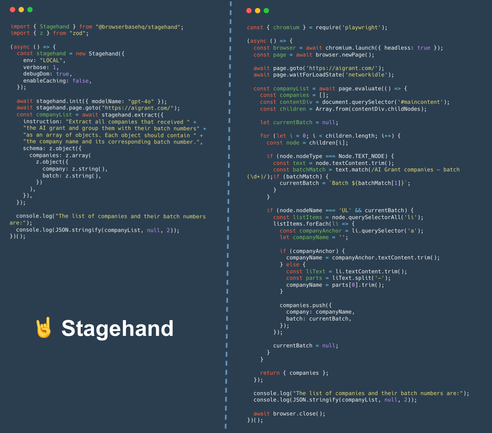

<div id="toc" align="center">
  <ul style="list-style: none">
    <a href="https://stagehand.dev">
      <picture>
        <source media="(prefers-color-scheme: dark)" srcset="https://stagehand.dev/logo-dark.svg" />
        
      </picture>
    </a>
  </ul>
</div>

<p align="center">
  An AI web browsing framework focused on simplicity and extensibility.<br>
  <a href="https://docs.stagehand.dev">Read the Docs</a>
</p>

<p align="center">
  <a href="https://www.npmjs.com/package/@browserbasehq/stagehand">
    <picture>
      <source media="(prefers-color-scheme: dark)" srcset="https://stagehand.dev/api/assets/npm?mode=dark" />
      
    </picture>
  </a>
  <a href="https://github.com/browserbase/stagehand/tree/main?tab=MIT-1-ov-file#MIT-1-ov-file">
    <picture>
      <source media="(prefers-color-scheme: dark)" srcset="https://stagehand.dev/api/assets/license?mode=dark" />
      
    </picture>
  </a>
  <a href="https://join.slack.com/t/stagehand-dev/shared_invite/zt-2tdncfgkk-fF8y5U0uJzR2y2_M9c9OJA">
    <picture>
      <source media="(prefers-color-scheme: dark)" srcset="https://stagehand.dev/api/assets/slack?mode=dark" />
      
    </picture>
  </a>
</p>

---

> [!NOTE]
> `Stagehand` is currently available as an early release, and we're actively seeking feedback from the community. Please join our [Slack community](https://join.slack.com/t/stagehand-dev/shared_invite/zt-2tdncfgkk-fF8y5U0uJzR2y2_M9c9OJA) to stay updated on the latest developments and provide feedback.

- [Intro](#intro)
- [Getting Started](#getting-started)
- [Model Support](#model-support)
- [How It Works](#how-it-works)
- [Stagehand vs Playwright](#stagehand-vs-playwright)
- [Prompting Tips](#prompting-tips)
- [Roadmap](#roadmap)
- [Contributing](#contributing)
- [Acknowledgements](#acknowledgements)
- [License](#license)

## Intro

Stagehand is the easiest way to build browser automations. It is completely interoperable with [Playwright](https://playwright.dev/) and has seamless integration with [Browserbase](https://browserbase.com/).

It offers three simple AI APIs (`act`, `extract`, and `observe`) on top of the base Playwright `Page` class that provide the building blocks for web automation via natural language.

Anything that can be done in a browser can be done with Stagehand. Think about stuff like:

1. Log into Amazon, search for AirPods, and buy the most relevant product
1. Go to Hacker News and extract the top stories of the day
1. Go to Doordash, find the cheapest pad thai, and order it to your house

These automations can be built with Playwright, but it can be very cumbersome to write the code, and it will be very vulnerable to minor changes in the UI.

Stagehand, especially when combined with Browserbase’s stealth mode, makes it easier to write durable code and bypass bot detection and captchas.

## Getting Started

### Quickstart

You can run `npx create-browser-app` to create a new Stagehand project configured to our default settings.

Read our [Quickstart Guide](https://docs.stagehand.dev/get_started/quickstart) in the docs for more information.

### Build and Run from Source

```bash
git clone https://github.com/browserbase/stagehand.git
cd stagehand
npm install
npx playwright install
npm run example # run the blank script at ./examples/example.ts
```

### Environment Variables

Stagehand is best when you have an API key for an LLM provider and Browserbase credentials. To add these to your project, run:

```bash
cp .env.example .env 
nano .env # Edit the .env file to add API keys
```

## Model Support

Stagehand leverages a generic LLM client architecture to support various language models from different providers. This design allows for flexibility, enabling the integration of new models with minimal changes to the core system. Different models work better for different tasks, so you can choose the model that best suits your needs.

#### Currently Supported Models

Stagehand currently supports the following models from OpenAI and Anthropic:

- **OpenAI Models:**

  - `gpt-4o`
  - `gpt-4o-mini`
  - `gpt-4o-2024-08-06`

- **Anthropic Models:**
  - `claude-3-5-sonnet-latest`
  - `claude-3-5-sonnet-20240620`
  - `claude-3-5-sonnet-20241022`

These models can be specified when initializing the `Stagehand` instance or when calling methods like `act()` and `extract()`.

### Additional Models

Stagehand is designed to be extensible, so you can add your own models by implementing the `LLMClient` interface. You can see an example of how to add a custom `LLMClient` [in our examples](./examples/external_client.ts).

## How It Works

The SDK has two major phases:

1. Processing the DOM (including chunking - _see below_).
2. Taking LLM powered actions based on the current state of the DOM.

### DOM processing

Stagehand uses a combination of techniques to prepare the DOM.

The DOM Processing steps look as follows:

1. Via Playwright, inject a script into the DOM accessible by the SDK that can run processing.
2. Crawl the DOM and create a list of candidate elements.
   - Candidate elements are either leaf elements (DOM elements that contain actual user facing substance), or are interactive elements.
   - Interactive elements are determined by a combination of roles and HTML tags.
3. Candidate elements that are not active, visible, or at the top of the DOM are discarded.
   - The LLM should only receive elements it can faithfully act on on behalf of the agent/user.
4. For each candidate element, an xPath is generated. this guarantees that if this element is picked by the LLM, we'll be able to reliably target it.
5. Return both the list of candidate elements, as well as the map of elements to xPath selectors across the browser back to the SDK, to be analyzed by the LLM.

#### Chunking

While LLMs will continue to increase context window length and reduce latency, giving any reasoning system less stuff to think about should make it more reliable. As a result, DOM processing is done in chunks in order to keep the context small per inference call. In order to chunk, the SDK considers a candidate element that starts in a section of the viewport to be a part of that chunk. In the future, padding will be added to ensure that an individual chunk does not lack relevant context. See this diagram for how it looks:



### Vision

The `act()` and `observe()` methods can take a `useVision` flag. If this is set to `true`, the LLM will be provided with a annotated screenshot of the current page to identify which elements to act on. This is useful for complex DOMs that the LLM has a hard time reasoning about, even after processing and chunking. By default, this flag is set to `"fallback"`, which means that if the LLM fails to successfully identify a single element, Stagehand will retry the attempt using vision.

### LLM analysis

Now we have a list of candidate elements and a way to select them. We can present those elements with additional context to the LLM for extraction or action. While untested on a large scale, presenting a "numbered list of elements" guides the model to not treat the context as a full DOM, but as a list of related but independent elements to operate on.

In the case of action, we ask the LLM to write a playwright method in order to do the correct thing. In our limited testing, playwright syntax is much more effective than relying on built in javascript APIs, possibly due to tokenization.

Lastly, we use the LLM to write future instructions to itself to help manage it's progress and goals when operating across chunks.

### Stagehand vs Playwright

Below is an example of how to extract a list of companies from the AI Grant website using both Stagehand and Playwright.



## Prompting Tips

Prompting Stagehand is more literal and atomic than other higher level frameworks, including agentic frameworks. Here are some guidelines to help you craft effective prompts:

### Do:

- **Use specific and concise actions**

```javascript
await page.act({ action: "click the login button" });

const productInfo = await page.extract({
  instruction: "find the red shoes",
  schema: z.object({
    productName: z.string(),
    price: z.number(),
  }),
});
```

- **Break down complex tasks into smaller, atomic steps**

Instead of combining actions:

```javascript
// Avoid this
await page.act({ action: "log in and purchase the first item" });
```

Split them into individual steps:

```javascript
await page.act({ action: "click the login button" });
// ...additional steps to log in...
await page.act({ action: "click on the first item" });
await page.act({ action: "click the purchase button" });
```

- **Use `observe()` to get actionable suggestions from the current page**

```javascript
const actions = await page.observe();
console.log("Possible actions:", actions);
```

### Don't:

- **Use broad or ambiguous instructions**

```javascript
// Too vague
await page.act({ action: "find something interesting on the page" });
```

- **Combine multiple actions into one instruction**

```javascript
// Avoid combining actions
await page.act({ action: "fill out the form and submit it" });
```

- **Expect Stagehand to perform high-level planning or reasoning**

```javascript
// Outside Stagehand's scope
await page.act({ action: "book the cheapest flight available" });
```

By following these guidelines, you'll increase the reliability and effectiveness of your web automations with Stagehand. Remember, Stagehand excels at executing precise, well-defined actions so keeping your instructions atomic will lead to the best outcomes.

We leave the agentic behaviour to higher-level agentic systems which can use Stagehand as a tool.

## Roadmap

At a high level, we're focused on improving reliability, speed, and cost in that order of priority.

## Contributing

> [!NOTE]  
> We highly value contributions to Stagehand! For support or code review, please join our [Slack community](https://join.slack.com/t/stagehand-dev/shared_invite/zt-2tdncfgkk-fF8y5U0uJzR2y2_M9c9OJA).

### Development tips

A good development loop is:

1. Try things in the example file
2. Use that to make changes to the SDK
3. Write evals that help validate your changes
4. Make sure you don't break existing evals!
5. Open a PR and get it reviewed by the team.

### Running evals

You'll need a Braintrust API key to run evals

```.env
BRAINTRUST_API_KEY=""
```

After that, you can run all evals at once using `npm run evals`

You can also run individual evals using `npm run evals -- your_eval_name`.

### Adding new evals

Running all evals can take some time. We have a convenience script `example.ts` where you can develop your new single eval before adding it to the set of all evals.

You can run `npm run example` to execute and iterate on the eval you are currently developing.

#### Adding a New Model

To add a new model to Stagehand, follow these steps:

1. **Define the Model**: Add the new model name to the `AvailableModel` type in the `LLMProvider.ts` file. This ensures that the model is recognized by the system.

2. **Map the Model to a Provider**: Update the `modelToProviderMap` in the `LLMProvider` class to associate the new model with its corresponding provider. This mapping is crucial for determining which client to use.

3. **Implement the Client**: If the new model requires a new client, implement a class that adheres to the `LLMClient` interface. This class should define all necessary methods, such as `createChatCompletion`.

4. **Update the `getClient` Method**: Modify the `getClient` method in the `LLMProvider` class to return an instance of the new client when the new model is requested.

### Building the SDK

Stagehand uses [tsup](https://github.com/egoist/tsup) to build the SDK and vanilla [esbuild](https://esbuild.github.io/d) to build the scripts that run in the DOM.

1. run `npm run build`
2. run `npm pack` to get a tarball for distribution

## Acknowledgements

This project heavily relies on [Playwright](https://playwright.dev/) as a resilient backbone to automate the web. It also would not be possible without the awesome techniques and discoveries made by [tarsier](https://github.com/reworkd/tarsier), and [fuji-web](https://github.com/normal-computing/fuji-web).

[Jeremy Press](https://x.com/jeremypress) wrote the original MVP of Stagehand and continues to be a major ally to the project.

## License

Licensed under the MIT License.

Copyright 2025 Browserbase, Inc.
