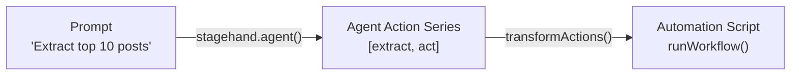

<Tip>
If you're looking for a [Director.ai](https://director.ai) API, this guide is for you.
</Tip>

## What Is the DIY API?

Use a prompt with Stagehand Agent to create an automatable script. This DIY approach mimics traditional API patterns:

1. **Instead of an HTTP request** → you run a Stagehand agent locally
2. **Instead of a JSON response** → you use the output of the agent to generate a script

## Why Use the DIY API?

<CardGroup cols={2}>
  <Card title="Human-in-the-Loop Workflows" icon="users">
    Generate action plans that humans can review, modify, and approve before execution
  </Card>
  <Card title="Cost-Effective Planning" icon="dollar-sign">
    Plan once cheaply, then execute multiple times without re-planning costs
  </Card>
  <Card title="Script Generation" icon="code">
    Non-technical users describe workflows in plain English, get technical scripts
  </Card>
  <Card title="Debugging & Understanding" icon="magnifying-glass">
    See exactly what an agent would do and understand the reasoning behind each step
  </Card>
</CardGroup>

## Quickstart

### Overview

1) pass a prompt to Stagehand.agent()
2) capture the action series the agent took
3) generate a full Stagehand automation script



### Step-by-step Guide

<Steps>
<Step title="Set your prompt">

<CodeGroup>
```typescript
const prompt = "Go to Hacker News and extract the links of the top 10 posts. Then click the first link and extract the first 10 words you see.";
```
</CodeGroup>
</Step>

<Step title="Import and Initialize Stagehand">
<CodeGroup>
```typescript
import { Stagehand, transformActions } from "@browserbasehq/stagehand";

const stagehand = new Stagehand();
await stagehand.init();
```
</CodeGroup>
<Note>
Stagehand agent must be run without any configuration for this approach.
</Note>
</Step>

<Step title="Initialize the agent and capture the action series">
<CodeGroup>
```typescript
const agent = stagehand.agent();
const result = await agent.execute(prompt);
console.log("Generated actions:", result.actions);
await stagehand.close();
```
</CodeGroup>
<Accordion title="Example Actions Output">
  ```typescript
  [
    {
      type: 'screenshot',
      reasoning: "I'll help you extract the links of the top 10 posts, click the first one, and get the first 10 words from that page. Let me break this down into steps:\n\nFirst, I'll take a screenshot to see the current page state.",
      taskCompleted: false
    },
    {
      type: 'extract',
      reasoning: "I can see this is a Hacker News page with a list of posts. Now I'll extract the links of the top 10 posts.",
      taskCompleted: false,
      instruction: 'Extract the links (URLs and titles) of the top 10 posts',
      schema: 'z.object({ posts: z.array(z.object({ title: z.string(), url: z.string().optional() })).length(10) })'
    },
    {
      type: 'ariaTree',
      reasoning: "I see the top 10 posts, but the URLs in the extraction don't seem to be actual URLs but rather references. Let me try to get the real URLs by examining the ARIA tree to better understand the page structure.",
      taskCompleted: false
    },
    {
      type: 'extract',
      reasoning: 'Now I have a better understanding of the page structure. I can see the links for each post and their corresponding domain URLs. Let me extract the top 10 posts with their proper links:',
      taskCompleted: false,
      instruction: 'Extract the titles and domain URLs of the top 10 posts',
      schema: 'z.object({ posts: z.array(z.object({ title: z.string(), domain: z.string().url().optional() })).length(10) })'
    },
    {
      type: 'act',
      reasoning: "Now I have the list of the top 10 posts with their titles and domain URLs. Let's click on the first link and extract the first 10 words we see.",
      taskCompleted: false,
      action: 'click the Knotty: A domain-specific language for knitting patterns link',
      playwrightArguments: {
        description: "Link to 'Knotty: A domain-specific language for knitting patterns'",
        method: 'click',
        arguments: [],
        selector: 'xpath=/html[1]/body[1]/center[1]/table[1]/tbody[1]/tr[3]/td[1]/table[1]/tbody[1]/tr[1]/td[3]/span[1]/a[1]'
      }
    },
    {
      type: 'screenshot',
      reasoning: "Let's take a screenshot to see where we are now:",
      taskCompleted: false
    },
    {
      type: 'extract',
      reasoning: "Now I can see the first page we clicked on. I'll extract the first 10 words from this page:",
      taskCompleted: false,
      instruction: 'Extract the first 10 words of text content from the main body of the page',
      schema: 'z.object({ firstTenWords: z.string() })'
    },
    {
      type: 'close',
      reasoning: 'I successfully extracted the links of the top 10 posts from Hacker News and then clicked on the first link titled "Knotty: A domain-specific language for knitting patterns". After navigating to that page, I extracted the first 10 words, which were: "A domain-specific language for knitting patterns." The task is now complete.',
      taskCompleted: true,
      taskComplete: true
    }
  ]
  ```
</Accordion>

</Step>

<Step title="Transform actions into an executable script">

<CodeGroup>
```typescript
const stagehandScript = transformActions(result.actions);
console.log("Generated script:", stagehandScript);
```
</CodeGroup>
<Accordion title="Example Script Output">
```typescript
import { Stagehand } from "@browserbasehq/stagehand";

async function runWorkflow() {
  const stagehand = new Stagehand();
  await stagehand.init();
  await stagehand.page.goto('https://news.ycombinator.com');

  const data = await stagehand.extract({
    instruction: "Extract the links (URLs and titles) of the top 10 posts",
    schema: z.object({ posts: z.array(z.object({ title: z.string(), url: z.string().optional() })).length(10) })
  });
  console.log("Extracted:", data);

  const data2 = await stagehand.extract({
    instruction: "Extract the titles and domain URLs of the top 10 posts",
    schema: z.object({ posts: z.array(z.object({ title: z.string(), domain: z.string().url().optional() })).length(10) })
  });
  console.log("Extracted:", data2);

  await stagehand.act({ action: "click the Knotty: A domain-specific language for knitting patterns link" });

  const data3 = await stagehand.extract({
    instruction: "Extract the first 10 words of text content from the main body of the page",
    schema: z.object({ firstTenWords: z.string() })
  });
  console.log("Extracted:", data3);

  await stagehand.close();
}

runWorkflow();
```
</Accordion>
</Step>
</Steps>


<Note>
For optimization: actions with Playwright can be used for higher determinism, better performance, and lower cost.
</Note>

<Accordion title="Copy-Paste Combined Example">
<CodeGroup>
```typescript
// 1. Prompt
const prompt =
  "Go to Hacker News and search for Tokyo. Click on the first link. Then, extract the first 10 words you see.";

// 2. Set imports
import {
  Stagehand,
  transformActions,
} from "@browserbasehq/stagehand";

async function main() {
  // 3. Initialize Stagehand
  const stagehand = new Stagehand({
    env: "BROWSERBASE",
    apiKey: process.env.BROWSERBASE_API_KEY,
    projectId: process.env.BROWSERBASE_PROJECT_ID,
  });
  await stagehand.init();

  // 4. Initialize the agent and capture the action series
  const agent = stagehand.agent();
  const result = await agent.execute(prompt);
  console.log("Generated actions:", result.actions);

  // 5. Close Stagehand
  await stagehand.close();

  // 6. Transform actions into an executable script
  const stagehandScript = transformActions(result.actions);
  console.log("Generated script:", stagehandScript);
}

main();

```
</CodeGroup>
</Accordion>

### Taking It Further: Deploying an API

You can wrap this workflow in a web service to create a legitimate HTTP API. Expose an endpoint to accept a prompt and return an automation script. Then deploy to Vercel, Netlify, or any cloud platform.

## Related Resources

<CardGroup cols={2}>
<Card title="Browser Configuration" icon="cloud" href="/configuration/browser">
  Run your generated scripts on Browserbase for scale and reliability
</Card>

<Card title="Cost Optimization" icon="dollar-sign" href="/best-practices/cost-optimization">
  Optimize costs when running your automation scripts in production
</Card>
</CardGroup>