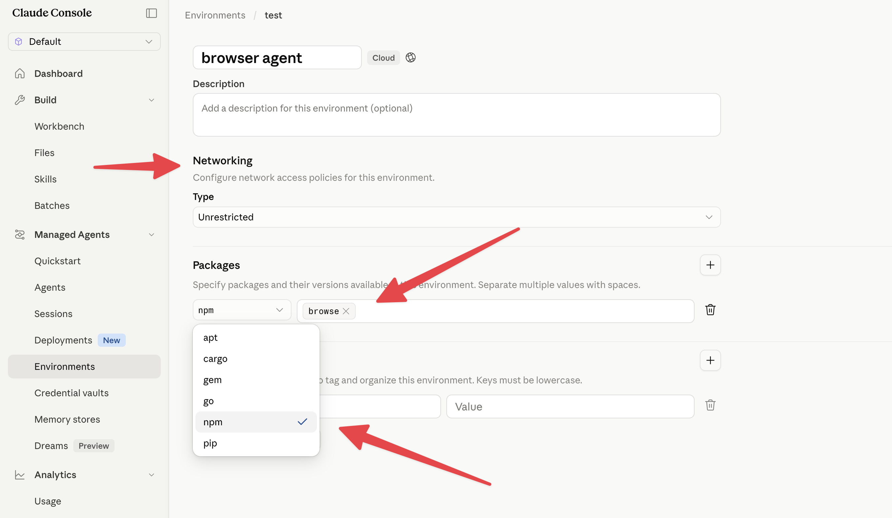
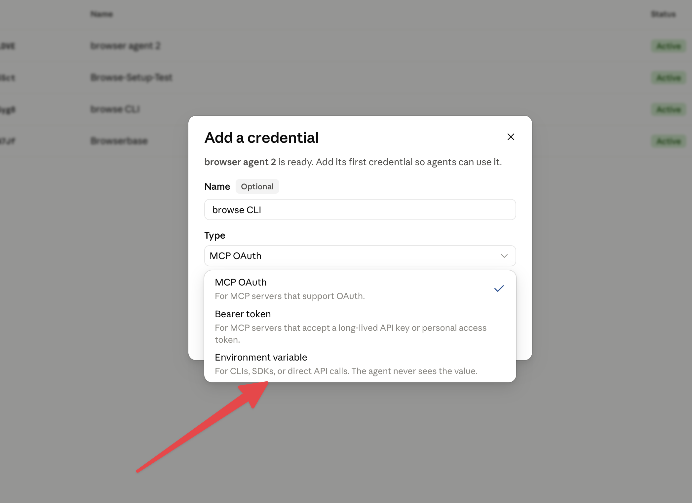
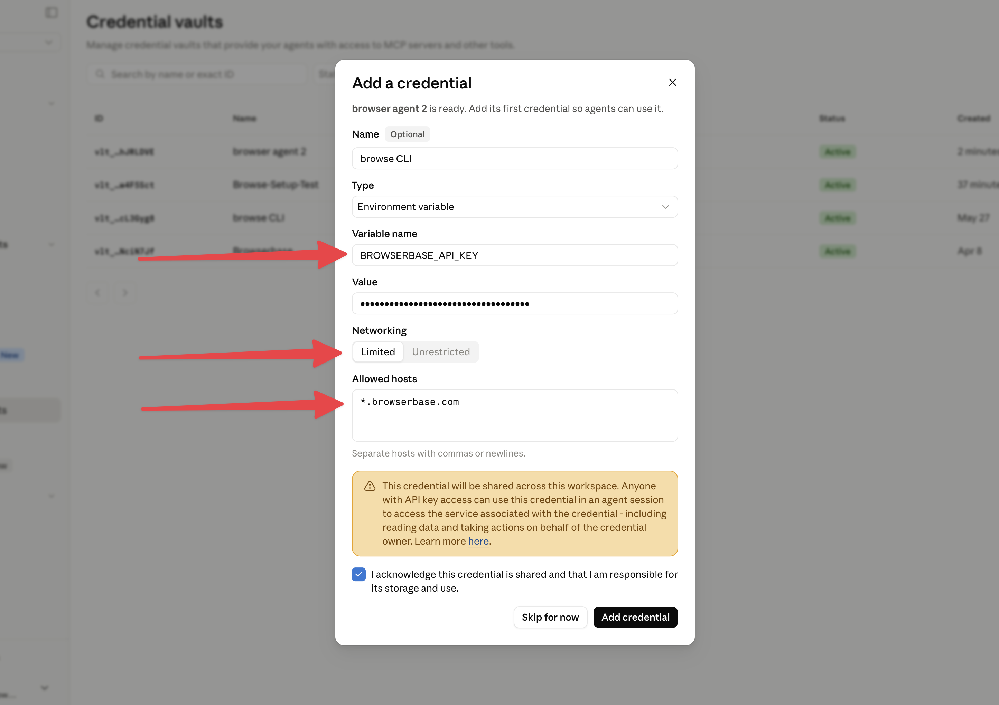
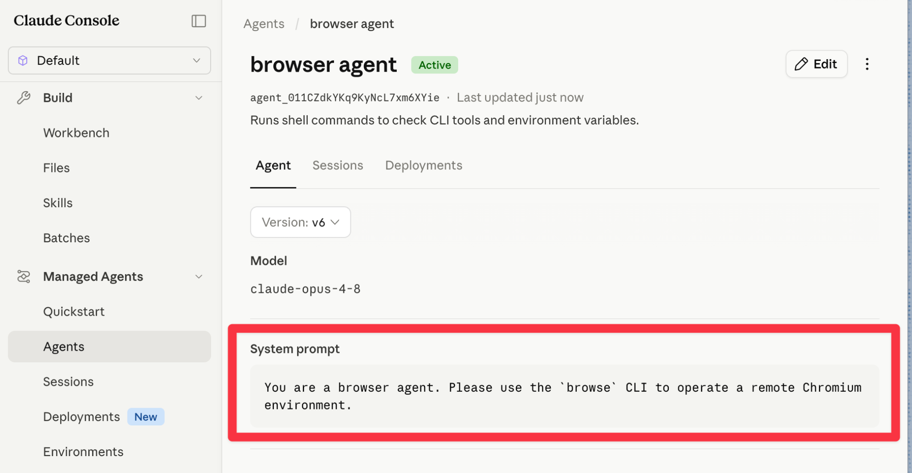
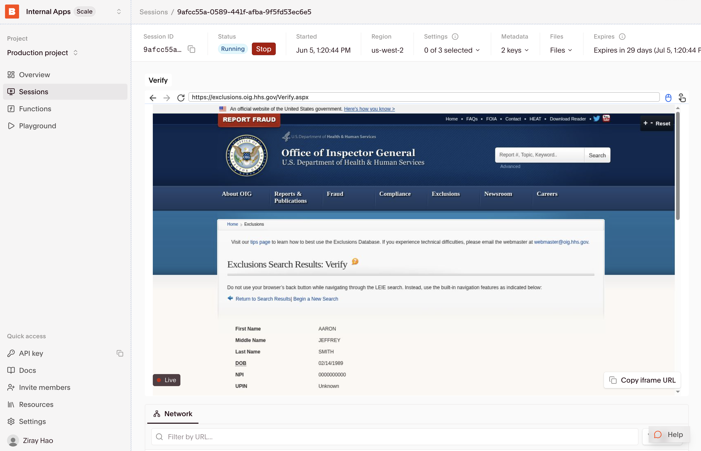

# Browser agents

> Cookbook for Anthropic Managed Agents
> 

This guide shows how to equip your Managed Agents with a browser, search, and fetch tooling to navigate the web. The `browse` CLI powers your agents to run UI testing, conduct deep document research, fill web forms and complex browser automations.

## 1. Create an Environment

Create a new Environment and set `browse` as a default `npm` package.

Optionally, allow “Unrestricted” networking for the browser agent to navigate the open web. Use “Limited” networking to scope the agent to particular websites.



The [browse](https://www.npmjs.com/package/browse) CLI is purpose-built for agents to navigate and act on the web. It offers command interfaces like `browse click` or `browse network` that makes it intuitive for agents to control and observe webpage state.

This CLI can work with (1) Managed Agents local chromium, (2) any CDP connection, (3) and natively with Browserbase Cloud sessions.

## 2. Create a Credential vault

Setup a new “Environment variable” type of Credential vault. This lets you agent securely use the `browse` CLI with an API key, which you can create one for free at [Browserbase developer dashboard](https://browserbase.com/).

1. Create a new Credential vault, choose type “Environment variable”
2. Name the variable `BROWSERBASE_API_KEY`
3. Choose “Limited” networking with `*.browserbase.com` for allowed hosts





## 3. Design your system prompt

Let your agent know that the `browse` shell command is available in the Environment. The CLI is designed to offer instructive progressive disclosure for usage documentation.

```yaml
name: browser agent
model:
  id: claude-opus-4-8
  speed: standard
description: Runs shell commands to check CLI tools and environment variables.
system: You are a browser agent. Use the `browse` CLI to operate a headless Chromium environment. Run `browse --help` to view the commands interface.
mcp_servers: []
tools:
  - configs: []
    default_config:
      enabled: true
      permission_policy:
        type: always_allow
    type: agent_toolset_20260401
skills: []
metadata: {}
```



## 4. Try out a few browser agent use cases

> Please run a full E2E test for UI regressions on this preview URL
> 

> Please check if Adam Smith is a licensed accountant in California
> 

> Please find the price of the Fellow Kettle on Target.com, and add to cart
> 

```bash
ant beta:sessions create \
  --agent "$AGENT_ID" \
  --environment-id "$ENVIRONMENT_ID"
```

When your Managed Agents use remote browsers through the CLI, you may watch and debug the live sessions in the [Browserbase sessions panel](https://browserbase.com/sessions).



