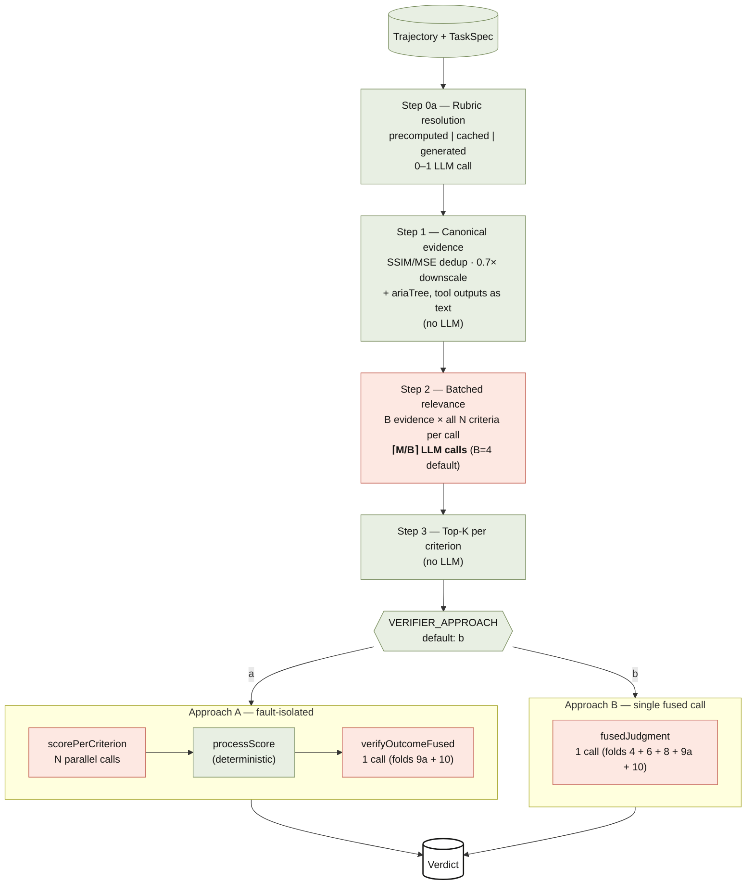

# Stagehand Verifier

Rubric-grounded trajectory verifier for Stagehand agent runs. Produces a structured `Verdict` from a recorded `Trajectory` and a `TaskSpec` — no live browser required.

The verifier is a TypeScript port of the Microsoft FARA paper's `MMRubricAgent` ([arxiv 2511.19663](https://arxiv.org/abs/2511.19663)), restructured to fit Stagehand's evals framework and trimmed of the per-criterion fan-out that's necessary for small-context-window models but counterproductive for frontier multimodal LLMs.

**Status:** Default backend for `V3Evaluator` when `STAGEHAND_EVALUATOR_BACKEND=verifier`. Legacy YES/NO `V3Evaluator.ask()` remains the default until benchmarking validates the new path end-to-end.

---

## What it produces

```ts
interface Verdict {
  outcomeSuccess: boolean;        // Did the agent accomplish the task?
  processScore: number;           // [0, 1] — Σ earned / Σ max across rubric criteria
  perCriterion: CriterionScore[]; // Per-rubric-item breakdown
  taskValidity: TaskValidity;     // { isAmbiguous, isInvalid, ambiguityReason?, invalidReason? }
  evidenceInsufficient: string[]; // Criteria the verifier couldn't ground confidently
  findings?: VerifierFinding[];   // Advisory diagnostics (agent_strategy, rubric_quality, etc.)
  firstPointOfFailure?: {         // Earliest taxonomy-classified failure when outcomeSuccess=false
    stepIndex: number;
    errorCode: string;            // e.g., "1.4" — Selection: wrong values
    category: string;
    description: string;
  };
  rawSteps?: Record<string, unknown>; // primaryIntent, reasoning, approach, optionalsMode, totals
}
```

The `outcomeSuccess` flag and `processScore` are deliberately independent. An agent can:
- Follow the right steps but get blocked by an uncontrollable factor (high `processScore`, `outcomeSuccess=false`)
- Reach the answer through an unexpected path (variable `processScore`, `outcomeSuccess=true`)

**Outcome vs process distinction (load-bearing):** `processScore` rewards effort and grants credit when an uncontrollable blocker prevented a sub-step (FARA's "blocker → full credit" rule). `outcomeSuccess` asks "did the agent deliver the user's actual ask?" — render failures, Access Denied walls, calendar widgets that don't accept clicks all count *against* outcome, regardless of cause. Exception: tasks worded "indicate if no available rooms / no flights" — reporting unavailability *is* the deliverable.

---

## Pipeline at a glance



Per-trajectory totals at default settings (M=evidence points after dedup, N=rubric criteria):

| Approach | LLM calls | Wall time (parallel) | Mean cost (Gemini Flash) |
|---|---|---|---|
| A (fault-isolated) | `⌈M/4⌉ + N + 1` ≈ 28-50 | ~270s | $0.13 |
| B (fused) | `⌈M/4⌉ + 1` ≈ 14-44 | ~310s | $0.12 |

Compared to the original FARA fan-out (~130 calls/verification), both approaches are 3–10× cheaper.

---

## The two approaches

### Approach A — per-criterion (fault-isolated)

One LLM call per rubric criterion sees only that criterion's top-K evidence. `processScore` is computed deterministically from the per-criterion earned-points; a final outcome call consumes the pre-scored rubric.

```
[Top-K] → [N per-criterion calls] → [processScore = Σ/max] → [1 outcome call]
```

**Use when:** you need fault isolation. If a single criterion's scoring is suspect, you can re-run just that call. Per-criterion contexts are smaller so individual LLM calls are faster.

### Approach B — fused (default)

One multimodal call sees the full rubric + per-criterion top-K evidence + action history + final answer, and returns per-criterion scores *plus* outcome in one structured response. Failure analysis and task validity are folded into the same response by default.

```
[Top-K] → [1 fused call] → Verdict (incl. failure_point + task_validity)
```

**Use when:** you want the cheapest pipeline. B's single call is dramatically faster at concurrency=1 (a few seconds vs minutes for A's N sequential calls). Default for the project — accuracy parity with A on the slices we've tested.

### Accuracy comparison

On a varied 30-trajectory ground-truth slice (10 categories × 3 difficulty levels):

| | Approach A | Approach B |
|---|---|---|
| Outcome accuracy vs GT | 80% | **87%** |
| `isInvalid` accuracy | 95-100% | 95-100% |
| processScore correlation A↔B | r = 0.80 | (per same data) |

B's 5–7pp edge traces to one consistent failure mode in A: over-application of the FARA "uncontrollable blocker → full credit" rule to `outcomeSuccess`. B correctly separates effort credit (process) from deliverable verification (outcome).

---

## Configuration

All env-var based; runtime overrides default behavior.

| Variable | Default | Purpose |
|---|---|---|
| `VERIFIER_APPROACH` | `b` | `a` or `b`. Picks the per-criterion vs fused pipeline. |
| `VERIFIER_OPTIONAL_STEPS` | `folded` | `folded` (cheap), `separate` (legacy 9a+10 calls), `skip` (no validity/failure). |
| `VERIFIER_RELEVANCE_BATCH_SIZE` | `4` | Evidence points per relevance-grading LLM call. |
| `VERIFIER_MAX_PARALLEL` | `8` | Concurrency cap on parallel LLM calls within the verifier. |
| `VERIFIER_TOP_K` | `5` | Top-K evidence points selected per criterion after Step 2. |
| `VERIFIER_SSIM_THRESHOLD` | `0.75` | Frames with SSIM ≥ this are deduped. |
| `VERIFIER_MSE_THRESHOLD` | `30` | Frames with MSE < this short-circuit as duplicates. |
| `VERIFIER_IMAGE_RESIZE` | `0.7` | Downscale factor before relevance grading. |
| `VERIFIER_DISABLE_RUBRIC_CACHE` | unset | Set `1` to skip `.rubric-cache/` and always regenerate via Step 0a. |
| `VERIFIER_PERSIST_TRAJECTORIES` | follows env | Force trajectory recorder on/off (`1`/`0`); defaults to on locally, off in CI. |
| `STAGEHAND_EVALUATOR_BACKEND` | `legacy` | Set `verifier` to route `V3Evaluator.verify()` and `.generateRubric()` to the new pipeline. |

---

## Public API

The verifier is internal to `@browserbasehq/stagehand`. Public surface is on `V3Evaluator`:

```ts
import { V3Evaluator } from "@browserbasehq/stagehand";

const evaluator = new V3Evaluator(v3);

// Generate a rubric from a task spec (Step 0a). Used when no precomputedRubric is provided.
const rubric = await evaluator.generateRubric({
  id: "my-task",
  instruction: "Search for flights from SF to NY",
  initUrl: "https://example.com",
});

// Verify a trajectory against a task spec. Returns a Verdict.
const verdict = await evaluator.verify(trajectory, taskSpec);
```

Hands-off integration via the evals adapter:

```ts
import { runWithVerifier, verdictToSuccess } from "@browserbasehq/stagehand-evals/framework/verifierAdapter";

const { verdict, trajectory, trajectoryDir } = await runWithVerifier({
  v3, agent,
  taskSpec: { id, instruction, initUrl, precomputedRubric },
  dataset: "agent-custom",
  agentOptions: { maxSteps: 50 },
});

return {
  _success: verdictToSuccess(verdict, "outcome"),
  outcomeSuccess: verdict.outcomeSuccess,
  processScore: verdict.processScore,
};
```

---

## On-disk trajectory layout

Each agent run that records a trajectory persists to:

```
.trajectories/<run-id>/<task-id>/
├── task_data.json           # TaskSpec + status + finalAnswer + latest verdict
├── trajectory.json          # steps[] with action history + evidence refs
├── times.json               # timing + token usage + stepCount
├── core.log                 # human-readable per-step summary
├── screenshots/
│   ├── probe/<N>.png        # tier-2: post-action probe screenshot per step
│   └── agent/<N>.png        # tier-1: image the model received per step
└── scores/
    ├── mmrubric_v1.json     # initial verdict from the agent run
    └── mmrubric_<label>.json # additional verdicts from `evals verify`
```

Image bytes are stored as files (not inlined in JSON) so `trajectory.json` stays diffable. Paths inside `trajectory.json` are relative so the dir is movable as a unit.

Format mirrors microsoft/fara's `example_trajectory/` layout closely enough that `verify_trajectories.py` can cross-validate without conversion.

---

## Two evidence channels per step

```ts
interface TrajectoryStep {
  // ...
  agentEvidence: { modalities: AgentEvidenceModality[] }; // tier 1
  probeEvidence: ProbeEvidence;                           // tier 2
}
```

**Tier 1 — `agentEvidence`:** exactly what the agent's LLM ingested as the tool result. For DOM/hybrid: tool returns (extract JSON, ariaTree, act describe-string). For CUA: the screenshot the provider received.

**Tier 2 — `probeEvidence`:** independent harness observations around each step. `page.url`, `page.screenshot()` post-step, optional `ariaTree` dump. Listener-gated — only captured when a trajectory recorder is attached.

The verifier's `collectCanonicalEvidence` (Step 1) reads from both channels and produces a unified `CanonicalEvidence[]` list that downstream stages score.

---

## Offline re-scoring

`evals verify <dir>` re-runs the verifier against a saved trajectory without launching a browser:

```bash
evals verify .trajectories/2026-05-15T17-16-27-216Z/eventbrite_tickets_book_170
evals verify <dir> --label tuning-pass-1     # writes scores/mmrubric_tuning-pass-1.json
evals verify <dir> --json                    # emit verdict JSON to stdout
evals verify <dir> --dry-run                 # don't persist
evals verify <dir> --model anthropic/claude-haiku-4-5
```

Useful for prompt iteration: ~30s per re-score (vs minutes for a fresh agent run). Multiple labels accumulate in `scores/` without overwriting prior verdicts.

---

## External harness adapters

External harnesses (Codex, Claude Code) convert their native traces into a `Trajectory` and feed the same verifier pipeline:

```ts
import { ClaudeCodeAdapter } from "@browserbasehq/stagehand-evals/framework/harnesses";

const trajectory = ClaudeCodeAdapter.fromHarnessResult(claudeCodeResult, taskSpec);
const verdict = await new V3Evaluator(v3, { backend: "verifier" }).verify(trajectory, taskSpec);
```

These adapters populate tier-1 `agentEvidence` from tool returns and leave tier-2 `probeEvidence` empty. The relevance pipeline operates on text evidence (tool outputs, agent reasoning, structured results) and degrades gracefully when visual evidence is absent — criteria that need a screenshot get flagged `evidenceInsufficient` rather than blocking the verdict.

See `packages/evals/framework/harnesses/` for the adapter source.

---

## Prompts library

All prompts are verbatim or carefully-adapted ports from microsoft/fara, in `prompts/`:

| File | Step | Purpose |
|---|---|---|
| `rubricGeneration.ts` | 0a | Generate a rubric from instruction + initUrl when none is provided. |
| `batchedRelevance.ts` | 2 | Score relevance of B evidence points against all criteria in one call. |
| `perCriterionScore.ts` | 4 (A) | Approach A's per-criterion analysis + earned-points scoring. |
| `fusedJudgment.ts` | 4+6+8+9a+10 (B) | Approach B's single combined judgment. |
| `fusedOutcome.ts` | 8+9a+10 (A) | Approach A's outcome call with folded failure + validity. |
| `firstPointOfFailure.ts` | 9a | Standalone failure analysis (used when `optionalSteps=separate`). |
| `taskValidity.ts` | 10 | Standalone validity classification (separate mode). |
| `outcomeVerification.ts` | 8 | Legacy outcome prompt (separate mode). |
| `rubricRescoring.ts` | 6 | Legacy whole-rubric rescoring (separate mode). |

Each prompt is documented with its variable substitutions in the file header.

---

## Error taxonomy

`errorTaxonomy.ts` ports FARA's 8-category error taxonomy:

| Cat | Class | Sub-codes |
|---|---|---|
| 1 | Selection | 1.1–1.4 |
| 2 | Navigation | 2.1–2.4 |
| 3 | Reasoning | 3.1–3.4 |
| 4 | Tool usage | 4.1–4.4 |
| 5 | Verification | 5.1–5.4 |
| 6 | Termination | 6.1–6.4 |
| 7 | Task ambiguity | 7.1–7.4 |
| 8 | Task validity | 8.1–8.6 |

Categories 1–6 are agent-controllable failures (reported in `firstPointOfFailure`). Categories 7–8 are properties of the task itself (reported in `taskValidity`).

`getTaxonomyText(start, end, depth)` is used by prompts to inject category descriptions into the judgment context.

---

## Performance characteristics

Benchmarked on 30 trajectories across WebTailBench + OnlineMind2Web (Approach B, Gemini Flash, parallelism=8–16):

| | mean | median | range |
|---|---|---|---|
| Wall time | 308s | 303s | 38–596s |
| LLM calls | 28.7 | 32 | 10–44 |
| Input tokens | 149K | 161K | — |
| Cost / run | $0.12 | — | — |

Cost ratio to the FARA original: **3–10× cheaper** (FARA fan-out runs ~130 calls/verification, ~$1.00 per run at similar model pricing).

---

## Limitations

1. **Step 0a robustness:** rubric generation occasionally fails with structured-output parse errors on Haiku (~5–10% on `onlineMind2Web` tasks). Failing tasks skip `agent.execute` entirely — no trajectory persisted. Cached rubrics in `.rubric-cache/<dataset>/` make retries reliable. A non-Haiku fallback is on the runway.
2. **Tier-1 images bypass dedup:** `loadAndReduceScreenshots` reads `probeEvidence.screenshot` only. CUA agent-side screenshots aren't deduped/downscaled. Acceptable today because they're rarely distinct from probe screenshots; revisit if a use case needs them.
3. **`processScore` non-determinism:** the same trajectory rescored multiple times can produce slightly different per-criterion scores (typical |Δ| ≤ 0.05). Outcome flips are rare but documented (see open question in the rethink HTML doc).
4. **Browserbase quota interaction:** `VERIFIER_MAX_PARALLEL=8` plus an agent run's `-c 10` concurrency can stress Gemini Flash's per-key rate limits. Drop `MAX_PARALLEL` if you see token-per-minute throttling.

---

## See also

- `packages/evals/README.md` — the evals harness that drives the verifier
- `packages/evals/framework/verifierAdapter.ts` — the `runWithVerifier` integration point
- `packages/evals/framework/harnesses/` — external harness adapters (Claude Code, Codex)
- `microsoft/fara` paper + repo — the source of the rubric methodology
