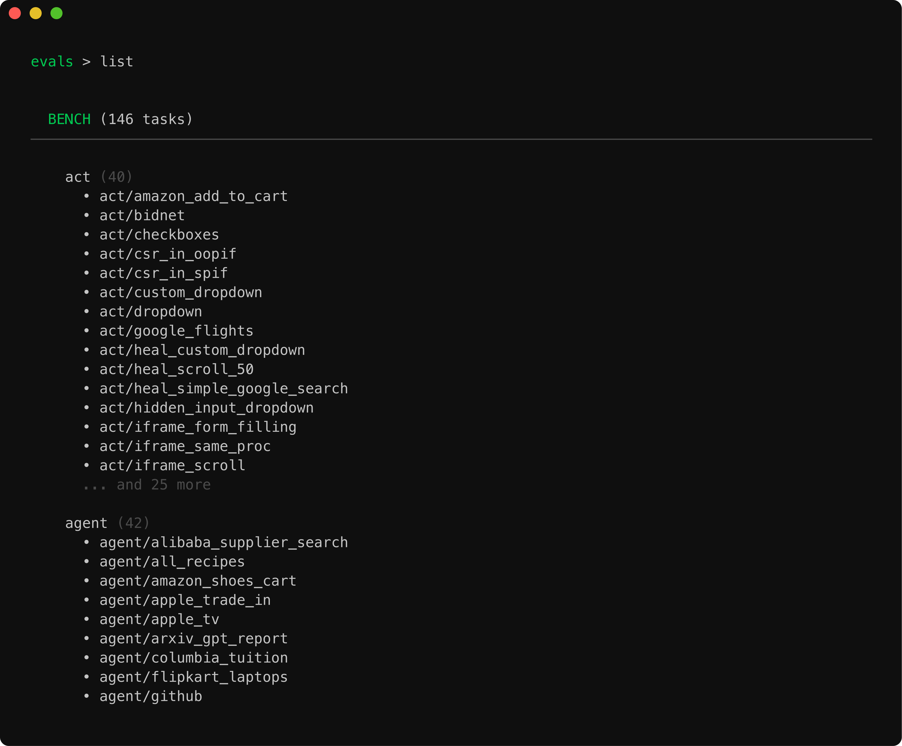
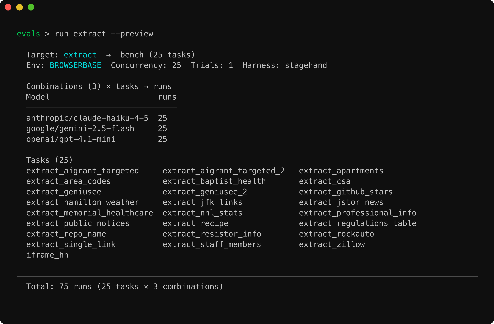

# Stagehand Evals

Agent benchmarks for Stagehand — `act`, `extract`, `observe`, `agent`, `combination`, plus dataset-backed suites (WebVoyager, OnlineMind2Web, WebTailBench, GAIA).

Driven by an interactive TUI (`evals`) or single-shot CLI (`evals run …`). Tasks are auto-discovered from `tasks/bench/<category>/` — no registration step.


## Quickstart

From the stagehand repo root:

```bash
pnpm install
pnpm build:cli   # also: pnpm build, if you haven't built the workspace yet
```

This links an `evals` binary on your `PATH`. Launch the REPL:

```bash
evals
```


Or run a single target:

```bash
evals run extract -t 3 -c 5
evals run b:webvoyager -l 10
```

A `.env` in `packages/evals/` is loaded automatically. Provide whichever provider keys (`OPENAI_API_KEY`, `ANTHROPIC_API_KEY`, `GOOGLE_GENERATIVE_AI_API_KEY`, …) and `BROWSERBASE_API_KEY` / `BROWSERBASE_PROJECT_ID` you need.

## TUI commands

Inside the REPL (or as `evals <command>` from your shell):

| Command | What it does |
| --- | --- |
| `run [target] [options]` | Run evals. Target can be a tier, category, task, or benchmark shorthand. |
| `list [tier] [--detailed]` | List discovered tasks and categories. |
| `new <tier> <category> <name>` | Scaffold a new task file. |
| `config [set\|reset\|path]` | Read or write defaults (env, trials, concurrency, model, …). |
| `experiments` | Inspect and compare Braintrust experiment runs. |
| `help` | Show command help. Append `--help` to any command for details. |

Use `Esc` to abort an in-flight run without exiting the REPL.

## Run targets

`evals run` accepts any of these shapes:

| Target | Meaning |
| --- | --- |
| _(none)_ / `all` | All bench tasks |
| `bench` | Entire bench tier |
| `act` / `extract` / `observe` / `agent` / `combination` | A category |
| `extract/extract_text` | A specific task |
| `b:webvoyager` / `b:onlineMind2Web` / `b:webtailbench` | Dataset-backed benchmark suite |

`evals list` shows everything that's been discovered:



## Common options

| Flag | Purpose |
| --- | --- |
| `-e, --env <local\|browserbase>` | Where the browser runs |
| `-t, --trials <n>` | Trials per task |
| `-c, --concurrency <n>` | Max parallel sessions |
| `-m, --model <id>` / `-p, --provider <name>` | Override the model/provider matrix |
| `--api` | Run via the Stagehand API instead of the SDK |
| `--harness <stagehand\|claude_code\|codex\|vercel_ai_sdk\|anthropic_sdk\|openai_agents_sdk\|cursor_sdk>` | Which agent harness drives the bench task (see [External harnesses](#external-harnesses) below) |
| `--skill-mode <none\|prompt_show\|injected>` | Skill-delivery arm for external harnesses |
| `--agent-mode <dom\|hybrid\|cua>` / `--agent-modes <csv>` | Stagehand agent mode (or matrix) |
| `-l, --limit <n>` / `-s, --sample <n>` / `-f, --filter key=value` | Suite shaping for benchmark targets |
| `--preview` | Print the resolved plan and exit — no browser, no LLM calls |

Defaults live in `evals.config.json` and can be edited via `evals config set …`.

`--preview` is useful for sanity-checking the plan before paying for a run:



A live run paints an in-place progress table, then prints a final summary with a per-model breakdown:


## External harnesses

Bench tasks can run under harnesses beyond the Stagehand SDK. `stagehand` is native; `claude_code` and `codex` route through those CLIs; `vercel_ai_sdk`, `anthropic_sdk`, `openai_agents_sdk`, and `cursor_sdk` are external-harness adapters that drive the `browse` CLI as a tool. Select one with `--harness`:

| Harness | `--harness` | Tier | What the harness gives the agent |
| --- | --- | --- | --- |
| Raw Anthropic SDK loop | `anthropic_sdk` | Bare | Nothing. Hand-rolled `while stop_reason == "tool_use"` loop. |
| Vercel AI SDK | `vercel_ai_sdk` | Bare | `generateText` + `stopWhen: stepCountIs(N)`. Loop plumbing only, zero behavior. |
| OpenAI Agents SDK | `openai_agents_sdk` | Bare-ish | Managed turn loop + tracing, but all behavior comes from dev-written `instructions`. Defaults untouched except `maxTurns`. |
| Claude Code | `claude_code` | Full | Full agentic scaffolding: skills, retries, planning, permission system. |
| Codex | `codex` | Full | Full agentic scaffolding. |
| Cursor SDK | `cursor_sdk` | Full | Ships Cursor's complete loop, planning, and tool behaviors — the same runtime that powers Cursor. |

### Skill-delivery modes

Orthogonal to harness choice, `--skill-mode <none|prompt_show|injected>` controls how the browse skill reaches the agent:

| Mode | What the agent gets |
| --- | --- |
| `none` (default for bare loops) | One-line system prompt + `--help` discovery only. |
| `prompt_show` | Same prompt, plus an instruction to run `browse skills show` first. Requires a browse CLI release that supports `browse skills show`; the adapter warns when the installed CLI lacks it. |
| `injected` | Skill content pre-loaded. For `claude_code` this is the existing behavior (SKILL.md installed, Skill tool). Bare loops have no Skill-tool primitive, so `injected` embeds the SKILL.md text directly in the system prompt. |

`claude_code`/`codex` keep their existing provisioning untouched; `--skill-mode` currently drives the four external-harness adapters.

### Per-harness overrides

| Harness | Model override env var | Step/turn cap env var | Model id format |
| --- | --- | --- | --- |
| `vercel_ai_sdk` | `EVAL_VERCEL_AI_SDK_MODELS` | `EVAL_VERCEL_AI_SDK_MAX_STEPS` | `provider/model`, resolved via stagehand's `getAISDKLanguageModel` |
| `anthropic_sdk` | `EVAL_ANTHROPIC_SDK_MODELS` | `EVAL_ANTHROPIC_SDK_MAX_STEPS` | Anthropic model id, no provider prefix |
| `openai_agents_sdk` | `EVAL_OPENAI_AGENTS_SDK_MODELS` | `EVAL_OPENAI_AGENTS_SDK_MAX_TURNS` | OpenAI model id, no provider prefix |
| `cursor_sdk` | `EVAL_CURSOR_SDK_MODELS` | _(none — Cursor manages its own loop)_ | Cursor catalog id, e.g. `cursor/composer-2.5` |

Bare-loop step cap defaults to 40 (`DEFAULT_BARE_LOOP_MAX_STEPS`) when not overridden.

### Browse provisioning + command gating

All four external-harness adapters share one provisioning path — `prepareBrowseCliHarnessAdapter`, the same contract `codex` delegates to: per-run temp cwd, per-run session name, a `browse` wrapper pinning `--local`/`--remote` + `--session`, built-CLI artifact checks, and `stop --force` cleanup. Command gating reuses `isAllowedBrowseCommand`: one `browse ...` command per tool call, no shell metacharacters (`; & | \` $ < >` rejected) — the bare loops expose exactly one tool (`browse`), never a shell.

Known limitation (`cursor_sdk`): Cursor's SDK doesn't expose an allow-list to hard-disable its native shell/file tools, so browse-only discipline there is prompt + custom-tool based rather than a `canUseTool`-style hard gate. Its native shell still runs inside the per-run temp cwd.

## Adding a bench task

```bash
evals new bench extract my_new_task
```

This drops a `defineBenchTask`-based file into `tasks/bench/extract/`. It will show up in `evals list` on next launch — no config edit needed.

```ts
// tasks/bench/extract/my_new_task.ts
import { defineBenchTask } from "../../../framework/defineTask.js";

export default defineBenchTask({
  name: "my_new_task",
  tags: ["regression"],
  run: async ({ stagehand, logger }) => {
    // ... drive stagehand, return { _success: boolean, ... }
  },
});
```

## Tracing / Observability

Runs stream into Braintrust when `BRAINTRUST_API_KEY` is set; otherwise a local summary prints to stdout. Use `evals experiments` to inspect and diff past Braintrust runs.
